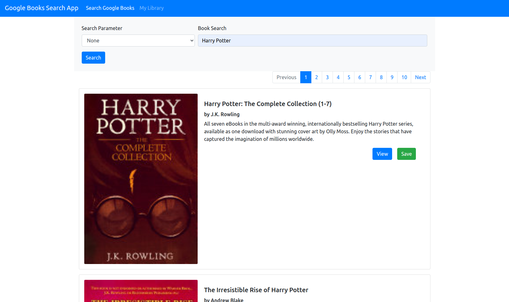
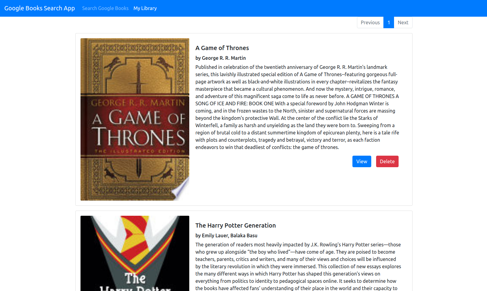

# React Google Books Search 

## Description

This is a React app using Bootstrap CSS framework and MongoDB to store books searched on Google Books.

Deployed Site: <https://ghoulish-moonlight-25926.herokuapp.com/>

## Table of Contents

* [Installation](#installation)
* [Usage](#usage)
* [License](#license)

## Installation

clone this Repo. Visit the deployed page link.

## Usage

## License

Licensed under MIT License.

## Questions

Contact [mc4506](mailto:mike4506@gmail.com)